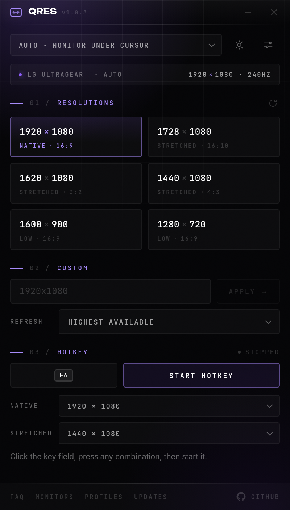
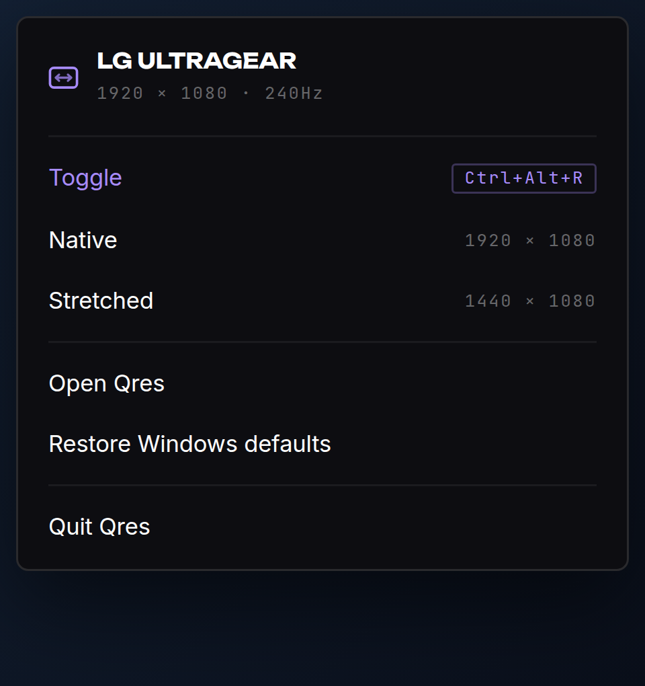

<div align="center">


# Qres

**Change your monitor's resolution and refresh rate from a hotkey.**

Built for stretched-res players who are tired of Windows Settings → System → Display → Advanced → three dropdowns → confirm, every single time they switch games.

Windows 10/11 · x64 · MIT




</div>

---

## What it does

Press a key. Your resolution changes. Press it again, it changes back.

That is the whole product. Everything else exists to make that one thing reliable on a real machine with more than one monitor and more than one game.

## Features

**Quick resolutions** — A grid generated from what your panel actually reports: its native mode, the stretched widths that keep its vertical lines (4:3, 3:2, 16:10), and same-shape lower resolutions for when you want frames instead of pixels. Every tile is one click.

**Global hotkey toggle** — Click the key field, press whatever combination you want, and it records what you actually pressed. Works from inside a fullscreen game. Pick the native/stretched pair once; the tray menu and the hotkey both use it.

**Extra hotkeys** — Bind additional combinations straight to a single resolution, on top of the toggle.

**Refresh rate control** — Every change carries a refresh rate. Leave it on *Highest available* and Qres asks the display for its fastest rate **at that resolution**, so dropping to 1440×1080 keeps your 240 Hz instead of quietly falling back to 60. Or pin a specific rate.

**Per-monitor targeting** — `Auto` changes whichever monitor your mouse is on when the hotkey fires, which is the one you are playing on. Or pin a specific display.

**Rename your monitors** — "LG ULTRAGEAR" becomes "Main" or "TV". The name is stored against the monitor's hardware id rather than its `\\.\DISPLAYn` slot, so it survives replugging and reordering.

**Game profiles** — Name a process (`VALORANT-Win64-Shipping.exe`) and a resolution. Qres switches when the game launches and puts native back when it exits. No hotkey needed.

**Safety net** — A change made in the window starts a 15-second countdown and reverts itself if you never confirm, so a mode your monitor cannot display never leaves you staring at a black screen. Hotkey and game-profile switches skip the dialog on purpose — nothing should land on top of your game.

**Custom resolution** — Type anything. Qres validates it against the driver before applying.

**Tray resident** — The window's X hides to the tray and Qres keeps running, so the hotkey stays live; minimise behaves normally and quitting is the tray menu's job. That menu is drawn by the app rather than by Windows, so it carries the same theme as everything else.

**Start with Windows** — Launches hidden, so the hotkey works before you open anything.

**Light and dark** — Same purple either way.

## Install

Grab the latest from [Releases](https://github.com/ritviksajeev/Qres/releases):

- **`Qres-Setup-x.y.z-win-x64.exe`** — installer, adds a Start Menu entry
- **`Qres-x.y.z-win-x64.zip`** — portable, extract and run

No admin needed. There is no code-signing certificate yet, so SmartScreen may warn on first launch — *More info → Run anyway*.

## Stretched resolution actually looking stretched

Qres sets the resolution. Whether the image fills your panel or sits in black bars is your **GPU scaling** setting, and no application can change that for you:

| GPU | Where |
|---|---|
| NVIDIA | Control Panel → Adjust desktop size and position → Scaling `Full-screen`, Perform scaling on `GPU`, tick *Override the scaling mode set by games and programs* |
| AMD | Adrenalin → Display → GPU Scaling `On`, Scaling Mode `Full panel` |
| Intel | Graphics Command Center → Display → Scale `Full Screen` |

Set it once. It sticks.

If a resolution you want is not in the grid, your display does not advertise it — create it in your GPU control panel (NVIDIA: *Change resolution → Customize → Create Custom Resolution*) and Qres picks it up. Modes marked with an amber dot are suggestions your display did not list; clicking still tries, and the driver will refuse if it cannot do it.

## Can this get me banned?

No. Qres calls `ChangeDisplaySettingsEx` — the same Windows API the Settings app uses. Nothing is injected into any process, no game memory is read, no input is synthesised. The global hotkey uses Electron's `globalShortcut`, which is an OS-level key reservation, not a keyboard hook.

## How it works

Node cannot call Win32 display APIs on its own, and shipping a prebuilt binary or a native module means an ABI to keep matched. Qres takes a third route:

1. `native/QresDisplay.cs` is a ~500-line Win32 CLI that enumerates displays and applies modes, printing JSON.
2. On first launch the app compiles it with the `csc.exe` that already ships inside Windows (`%WINDIR%\Microsoft.NET\Framework64\v4.0.30319`) and caches the result in `%LOCALAPPDATA%\Qres\bin`, keyed by a hash of the source.
3. Every call after that is a ~20 ms `execFile`.

No SDK to install, no `node-gyp`, no committed binary, and the helper is independently runnable if you ever want to debug it:

```
%LOCALAPPDATA%\Qres\bin\qrdisplay-<hash>.exe list
%LOCALAPPDATA%\Qres\bin\qrdisplay-<hash>.exe set --display auto --width 1440 --height 1080 --refresh max
```

If `csc.exe` is missing, it falls back to compiling the same source in-memory through PowerShell.

## Uninstalling

Settings → Danger zone → **Uninstall Qres**. It clears the settings file, the cached display helper and the start-with-Windows entry, then hands over to the Windows uninstaller if you used the installer. A portable copy has nothing registered to remove, so it tells you which folder is left to delete.

You can also use Windows Settings → Apps, if you installed with the `.exe`; that removes the program but leaves `%APPDATA%\Qres` behind, which you can delete by hand.

## Where it keeps things

| Path | What |
|---|---|
| `%APPDATA%\Qres\qres.json` | settings, hotkeys, game profiles |
| `%LOCALAPPDATA%\Qres\bin\` | the compiled display helper |

Both are safe to delete; both are rebuilt.

## Development

```bash
npm install
npm run dev        # Vite on :5183 + Electron
npm run typecheck
npm run build      # typecheck + renderer bundle
npm run dist       # Windows installer + portable zip into release/
```

```
electron/
  main.cjs       window, IPC, the single apply path, revert guard
  display.cjs    finds/builds the C# helper, parses its JSON
  hotkeys.cjs    global shortcut registry
  profiles.cjs   process watcher for game profiles
  tray.cjs       tray menu
  updates.cjs    GitHub releases check
  store.cjs      persisted settings
native/
  QresDisplay.cs   the Win32 layer
src/             React renderer (TypeScript)
```

The renderer is plain React with no UI framework — the styling is the same token set as [evzero.org](https://evzero.org).

## License

MIT — see [LICENSE](LICENSE).

Made by [EvZero](https://evzero.org).
